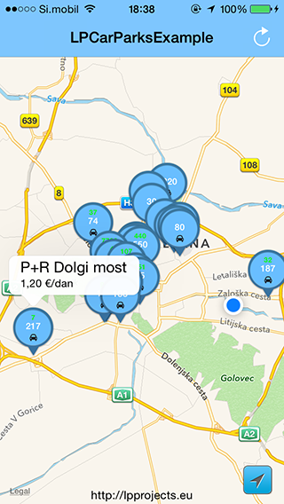

#LPLjubljanaCarParksFunctions

LPLjubljanaCarParksFunctions is an iOS library that provides easy access to car parks in Ljubljana.

http://www.lpt.si/parkirisca



Created by Luka Penger
http://lukapenger.eu

##Requirements

* Xcode 5.0 or later
* iOS 7.0 or later
* [Cocoapods](http://cocoapods.org)

##Usage

If you'd like to include this component as a pod using CocoaPods, just add the following line to your Podfile:

`pod "LPLjubljanaCarParksFunctions"`

##ARC

LPLjubljanaCarParksFunctions uses ARC (Automatic Reference Counting).

If you are using LPLjubljanaCarParksFunctions in your non-arc project, you will need to set a `-fobjc-arc` compiler flag on all of the LPLjubljanaCarParksFunctions source files.

To set a compiler flag in Xcode, go to your active target and select the "Build Phases" tab. Now select all LPLjubljanaCarParksFunctions source files, press Enter, insert `-fobjc-arc` and then "Done" to disable ARC for LPLjubljanaCarParksFunctions.

##Uses Frameworks - Libraries

* UIKit.framework
* Foundation.framework

LPLjubljanaCarParksFunctions uses AFNetworking library for networking.
https://github.com/AFNetworking/AFNetworking

##Delegate methods

```objective-c
- (void)ljubljanaCarParksFunctionsWillLoadParks:(LPLjubljanaCarParksFunctions *)ljubljanaCarParksFunctions;
- (void)ljubljanaCarParksFunctions:(LPLjubljanaCarParksFunctions *)ljubljanaCarParksFunctions didLoadParks:(NSMutableArray *)parksList parkingMachines:(NSMutableArray *)parkingMachinesList;
- (void)ljubljanaCarParksFunctions:(LPLjubljanaCarParksFunctions *)ljubljanaCarParksFunctions errorLoadingCarParks:(NSError *)error;

- (void)ljubljanaCarParksFunctions:(LPLjubljanaCarParksFunctions *)ljubljanaCarParksFunctions didLoadOccupancyToCarParks:(NSMutableArray *)parksList;
- (void)ljubljanaCarParksFunctions:(LPLjubljanaCarParksFunctions *)ljubljanaCarParksFunctions errorLoadingOccupancyToCarParks:(NSError *)error;
```

```objective-c
#pragma mark - LPLjubljanaCarParksFunctions Delegate

- (void)ljubljanaCarParksFunctionsWillLoadParks:(LPLjubljanaCarParksFunctions *)ljubljanaCarParksFunctions
{
    NSLog(@"ljubljanaCarParksFunctions - WillLoadParks");
}

- (void)ljubljanaCarParksFunctions:(LPLjubljanaCarParksFunctions *)ljubljanaCarParksFunctions didLoadParks:(NSMutableArray *)parksList parkingMachines:(NSMutableArray *)parkingMachinesList
{
    NSLog(@"%d parks, %d parking machines", parksList.count, parkingMachinesList.count);
}

- (void)ljubljanaCarParksFunctions:(LPLjubljanaCarParksFunctions *)ljubljanaCarParksFunctions errorLoadingCarParks:(NSError *)error
{
    NSLog(@"ljubljanaCarParksFunctions - errorLoadingCarParks: %@",error);
}

- (void)ljubljanaCarParksFunctions:(LPLjubljanaCarParksFunctions *)ljubljanaCarParksFunctions didLoadOccupancyToCarParks:(NSMutableArray *)parksList
{
    NSLog(@"ljubljanaCarParksFunctions - didLoadOccupancyToCarParks");
}

- (void)ljubljanaCarParksFunctions:(LPLjubljanaCarParksFunctions *)ljubljanaCarParksFunctions errorLoadingOccupancyToCarParks:(NSError *)error
{
    NSLog(@"ljubljanaCarParksFunctions - errorLoadingOccupancyToCarParks: %@", error);
}
```

##License

This code is distributed under the terms and conditions of the [MIT license](https://github.com/luka1995/LPLjubljanaCarParksFunctions/blob/master/LICENSE).

##Change log

A brief summary of each LPLjubljanaCarParksFunctions release can be found on the [wiki](https://github.com/luka1995/LPLjubljanaCarParksFunctions/wiki/Change-log).
